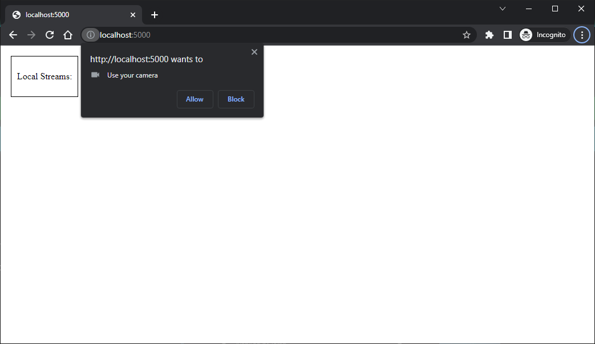
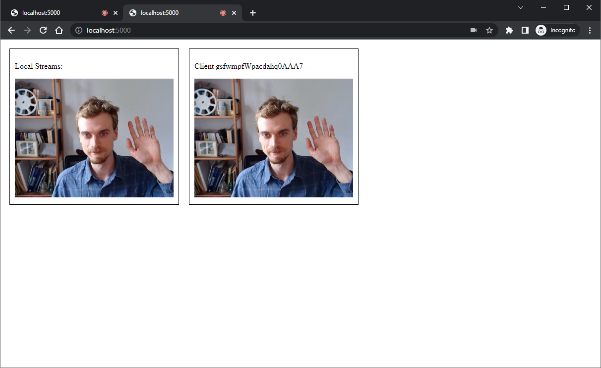
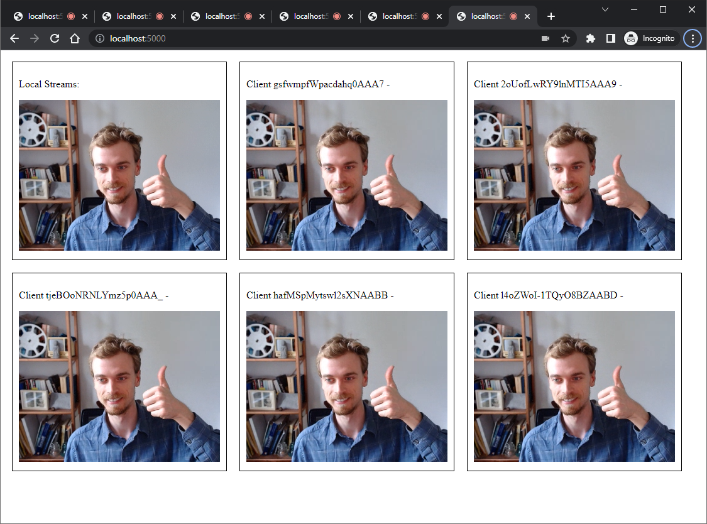
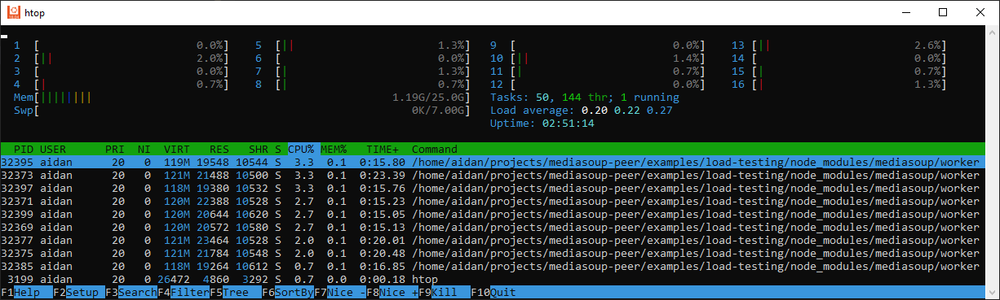

## Load Testing Example

Peers using this application will auto-connect to other peers!  Use this example to load-test your server.  

1. Open a single tab and manually approve the getUserMedia request: 

2. Open another browser tab and it will each automatically send a camera feed.  Both tabs will auto-connect to one another:

3. Open many tabs!

4. Monitor your server's CPU usage with the `htop` utility which is installed on many Linux systems:

Note that to accurately test load on the server (rather than a single client), you will have to spread the load across multiple devices.  Otherwise, you will likely be limited by limitations on the client-side.